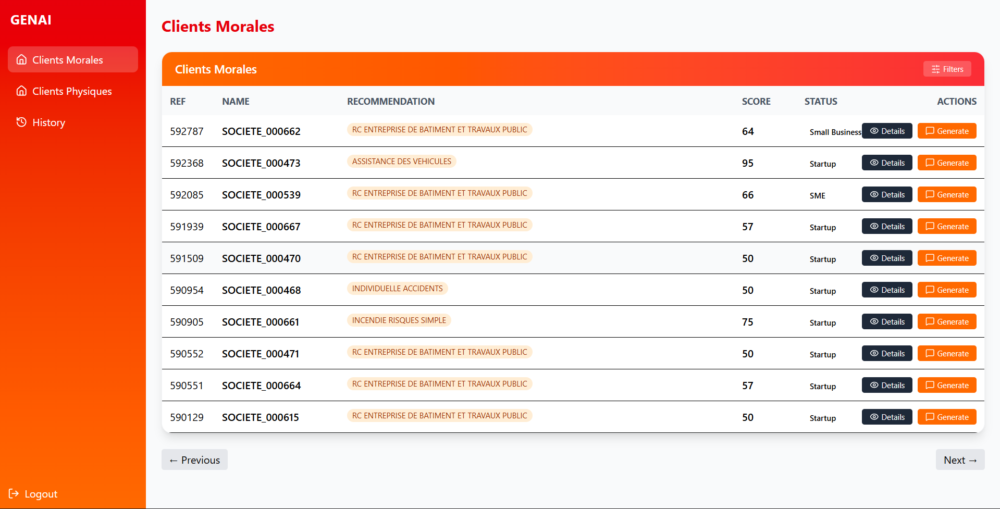
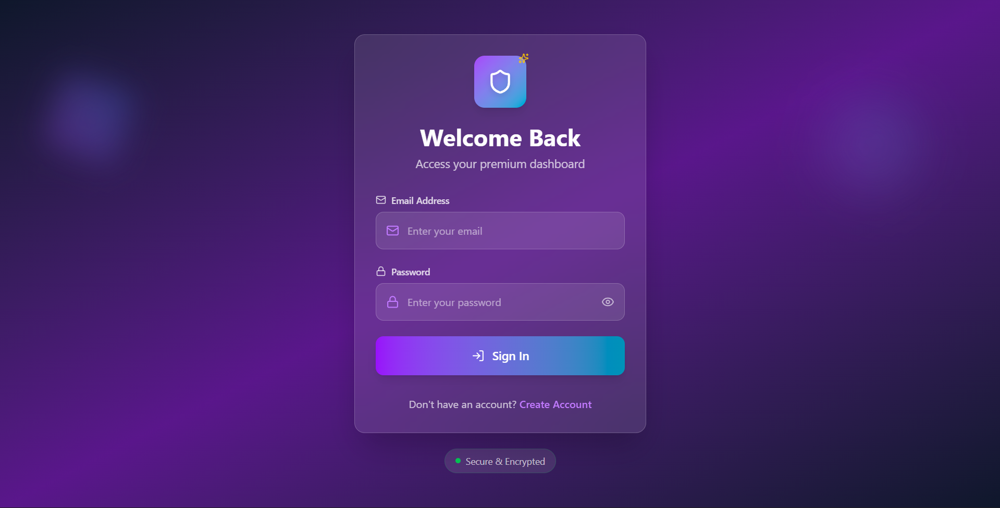

# BH-Next-Hackathon

## Overview
This project is a **prototype commercial business intelligence platform**, developed for the **BH Next Hackathon**.  
It integrates **data processing, recommendation systems, scoring, and client communication tools** within a modular backend–frontend architecture.

---

## Backend Features

### Authentication & User Management
- Secure login & signup via API routes  
- User models and schemas for managing profiles and permissions  

### Client Management
- API endpoints for physical and moral clients  
- Data models and schemas for client information  
- Frontend integration for client lists and detail views  

### Recommendation System
- Business and individual recommendation engines  
- Alerts and claims analysis modules  
- Preprocessing utilities (cleaning, grouping)  
- API endpoints to generate and retrieve recommendations  

### Scoring System
- Business and individual scoring modules  
- API endpoints for scoring operations  
- Data models for storing and retrieving scores  

### History Tracking
- Track user and client actions  
- History APIs, services, models, and schemas  

### Communication
- Email and WhatsApp integration  
- Message composer with history tracking in frontend  

---

## Frontend Features

### Client Dashboard
- Client list with detail popups  
- Status badges for client states  

### History & Messaging
- History table for tracking recommendations and actions  
- Message composer and modals for sending/viewing messages  

### Authentication UI
- Login and signup pages  
- Protected routes for authenticated sessions  

### Navigation & Layout
- Navbar and layout components for structured navigation  

---

## Data & Utilities
- Data stored in **Parquet** and **CSV** for efficient processing  
- **SQL scripts** for database schema and operations  
- Utility modules for data cleaning, grouping, and transformation  

---

## Prototype Notes
- Modular and extensible architecture  
- Clear separation of API, core logic, services, and frontend  
- Features are subject to change and expansion as the prototype evolves  
