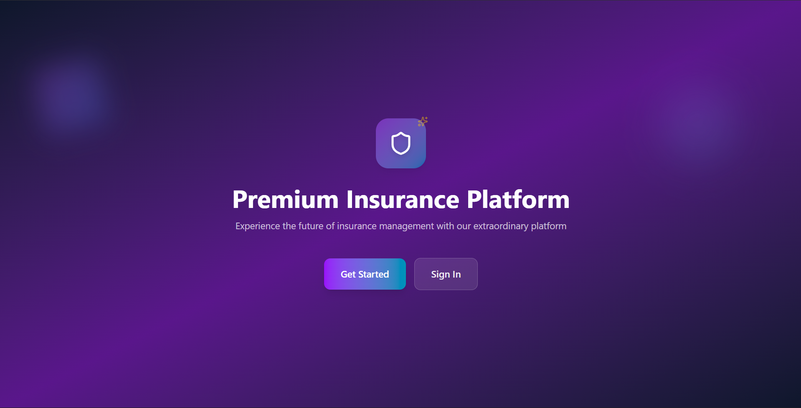

# BH-Next-Hackathon

## Overview
This project is a **prototype commercial business intelligence platform**, developed for the **BH Next Hackathon**.  
It integrates data processing, recommendation systems, scoring, alerts, message-history, and client communication tools within a modular backend–frontend architecture.

---

## Backend Features

### Authentication & User Management
- Secure login & signup via API routes  
- User models and schemas for managing profiles and permissions  

### Client Management
- API endpoints for physical and moral clients  
- Data models and schemas for client information  
- Frontend integration for client lists and detail views  

### Recommendation System
- Business and individual recommendation engines  
- Alerts and claims analysis modules  
- Preprocessing utilities (cleaning, grouping)  
- API endpoints to generate and retrieve recommendations  

### Scoring System
- Business and individual scoring modules  
- API endpoints for scoring operations  
- Data models for storing and retrieving scores  

### History Tracking
- Track user and client actions (message responses, views, etc.)
- Linked to client and user records so you can view message threads per client

### Communication
- Email and WhatsApp integration  
- Message composer with history tracking in frontend  

### Alerts & Scheduling
- Scheduled job (cron/worker) runs daily to detect clients/products with close expiry dates.
- Send notifications to clients when a product's expiration date is near

---

## Frontend Features

  

### Client Dashboard

  
  

### History & Messaging

  
  

### Recommendation Generation

  

### Authentication UI

  

### Alerts

  

### Navigation & Layout
- Navbar and layout components for structured navigation
- 
---

## Data & Utilities
- Data stored in **Parquet** and **CSV** for efficient processing  
- **SQL scripts** for database schema and operations  
- Utility modules for data cleaning, grouping, and transformation  

---

## Prototype Notes
- Modular and extensible architecture  
- Clear separation of API, core logic, services, and frontend  
- Features are subject to change and expansion as the prototype evolves  
